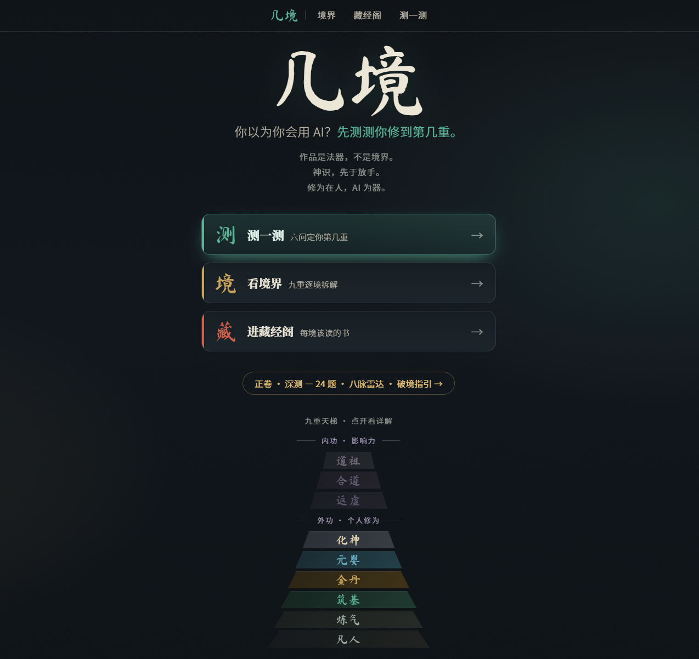
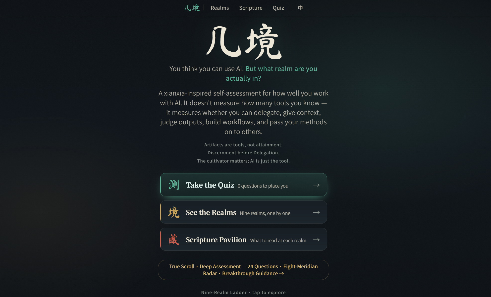

<div align="center">

# 几境 · Jǐjìng

### 你以为你会用 AI？来测测你修到第几重。

**AI 修为天梯 —— 把"会不会用 AI"修成一套修仙境界**

[**▶ 进去修炼一下 · 9jing.top**](https://9jing.top)



中文 ｜ [English](#english-cross-the-realms)

</div>

---

## 这是个啥

凡人用 AI，问一句答一句，把幻觉当真理，还以为自己很会用。

**「几境」是一座修仙天梯，量的不是"你学了多少 AI"，而是"你到底会不会用 AI"。**

九重境界，从 **凡人** 到 **道祖**，一重一重往上爬：

> 凡人 → 炼气 → 筑基 → 金丹 → 元婴 → 化神 →（内功）返虚 → 合道 → 道祖

爬之前先记住一句话——**作品是法器，不是境界。** 你做出一个能跑的 AI demo，那只是捡到一件法器，证明不了你的内力。真修为是：稳定、能复现、能迁移、还能让别人也跑得通。

还有一条铁律，破了就**走火入魔**：

> **神识（你判断得了 AI 的好坏）必须先于放手（你敢把活全交给它）。**
> 还看不出它在胡说就急着放手？那不叫高手，叫蒙着眼狂奔。

## 进去能干嘛

🧭 **转罗盘** —— 一只能拖着转的古风修为罗盘，转到哪一境，就给你讲透那一境的判据、心法、和会怎么走火入魔。

📜 **逛藏经阁** —— 一对推开的双扇门书柜，按境陈列 **23 本** 真·精选典籍（不是凑数，是真懂这条线的人挑的）。中缝压着一道封条：**神识既成，方可放手。** 点书脊抽卷一观。

🔮 **测一测** —— 6 问，测出你修到第几重，外加诊断你中了哪只**心魔**（"沉睡的车手"？"事必躬亲"？"道心蒙尘"？对号入座，扎心了别怪我）。测完直接把你这一境该读的典籍甩给你。

📈 **正卷 · 深测** —— 嫌 6 问不够准？**24 题**深测，量出你**八脉**强弱（委托 / 吐纳 / 蕴藏 / 神识 / 守心 / 周天 / 法门 / 传灯），画一张**八脉雷达图**，再按你卡住的那道坎给出**破境指引**。

## 心魔录（看看你中了几个）

- 🪬 **法宝 ≠ 修为** —— 买了一堆 AI 工具订阅，功力却原地踏步
- 😴 **沉睡的车手** —— 放手却不兜底，把幻觉当真理（最危险）
- 🐜 **事必躬亲** —— 看得清却不敢放手，事事逐字盯，累死自己
- 🌫️ **道心蒙尘** —— 连判断都外包给 AI，自己的能力悄悄萎缩

---

> 👉 **别光看，[进去测一测你修到第几重](https://9jing.top)，截图发出来对个号。**

---

<details>
<summary>🛠 给好奇"这玩意儿咋做的"的人（技术彩蛋，点开看）</summary>

<br>

- **纯前端、零框架、零构建**：五个独立 HTML，CSS/JS 内联，开箱即跑。
- **移动优先 · 单屏**：每页一屏装下，背景 fixed 铺满不留白。
- **自绘 SVG 古风罗盘**：八卦 + 二十四向 + 天池 + 天心十道，Pointer Events 实现拖拽旋转 + 就近吸附 + 轻点选中。
- **CSS 3D 透视**：藏经阁双扇门用 `rotateY` 做出"推开门"的进深，封条嵌在中缝。
- **字体本地子集化**：毛笔字 + 正文只打包站内用到的字，国内加载快、不依赖外网。
- **思想来源**：Anthropic《AI Fluency》4D 框架（委托/吐纳/神识/守心）、Ethan Mollick《Co-Intelligence》《Jagged Frontier》、Anthropic《Building Effective Agents》《Effective Context Engineering》、Hamel Husain evals 系列、Chip Huyen《AI Engineering》等——全收在藏经阁里。

本地跑：
```bash
python3 -m http.server 8000   # 然后开 http://localhost:8000
```

</details>

---

<a name="english-cross-the-realms"></a>

## English · Cross the Realms

### You think you're good at AI? Let's see which realm you've actually reached.

<div align="center"></div>

**Jǐjìng (几境)** is a cultivation ladder (xianxia-style) that measures **how well you *wield* AI — not how much AI you've studied.**

Nine realms, from **Mortal** to **Dao Ancestor**:

> Mortal → Qi Refining → Foundation → Golden Core → Nascent Soul → Spirit Severing →（inner）Void Return → Dao Unity → Dao Ancestor

One creed before you climb: **an artifact is a tool, not a rank.** A working demo just means you picked up a nice weapon — it doesn't prove your inner power. Real mastery = reproducible, transferable, and usable by others.

And one iron law — break it and you suffer **qi deviation (走火入魔)**:

> **Discernment must come before Autonomy.** Handing everything to the AI before you can judge its output isn't mastery — it's sprinting blindfolded.

**Inside you can:**
- 🧭 **Spin the compass** — a draggable geomantic luopan; land on a realm to see its criteria, mindset, and failure mode.
- 📜 **Browse the Scripture Hall** — double doors holding **23 hand-picked readings**, sealed in the middle by *"Discernment before Autonomy."*
- 🔮 **Take the quiz** — 6 questions to place you on the ladder and diagnose your inner demon.

> 👉 **Stop reading — [go find your realm at 9jing.top/en](https://9jing.top/en).**

---

<div align="center">

**作者 / Author**: Hugin-Z
**许可 / License**: CC BY-NC 4.0（署名-非商业性使用 / Attribution-NonCommercial）

*作品是法器，不是境界。 · An artifact is a tool, not a rank.*

</div>
